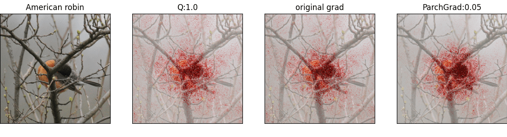
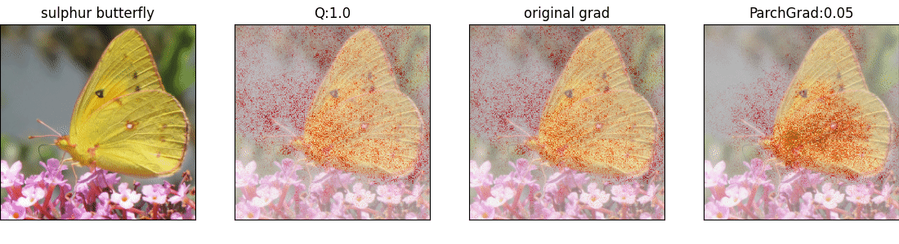

# Partitioned Channel Gradient for Reliable Input Attribution 
*Bumjin Park, Giyeong Jeon, and Jaesik Choi, 2023* 

<p align="center">
 
</p>

## Selected Visualziations 

<div style="border:1px solid #DDDDFF;border-radius:10px;padding:10px;" >
<p align="center" >





</p>
</div>

## Tutorials 

You can run [tutorials/parchgrad.ipynb](https://github.com/fxnnxc/parchgrad/blob/main/tutorials/parchgrad.ipynb). 


### Code Explanation 

```python
# get pretrained vision model 
encoder = "resnet18"
device="cuda:0"
base_dir = f"../data/{encoder}"
model = get_pretrained_model(encoder) 
model.to(device)
model.eval()

# set statistics
method = 'cls'
wrapper = get_hook_wrapper(encoder, model, method) 
wrapper.prepare_parchgrad(base_directory=base_dir, device=device) # setting statistics for each convolutions

# set hook modules (modifying gradients) 
layer_ratio=None # 0.5
selected_convolutions = wrapper.get_default_hook_convolutions(layer_ratio)
wrapper.set_hook_modules(selected_convolutions)

# get input attribution funciton
from parchgrad.attribution_methods import get_input_attrib
input_attrib = get_input_attrib('grad')
attr = input_attrib(wrapper, x, y, 
                    cls=y, 
                    modify_gradient=False if flags.method == 'normal' else True,
                    quantile=None,
                    alpha=flags.alpha,
                    p_value_threshold=flags.p_value_threshold,
                    variance_conservation=flags.variance_conservation,
                    exact_variance=flags.exact_variance,
                    gamma_infinity=flags.gamma_infinity,
                    enable_forward_hook=True if flags.method == 'ins' else False, 
)

# done 
```


## Custom Model 

### 1. Activations must be gathered to select important channels

```bash 
export encoder=resnet18
bash shells/compute_stats.sh
```
 
### 2. Setting convoultional layers to be hooked. 

### 3. Run ParchGrad! 


## Computation of CLS p-values 

